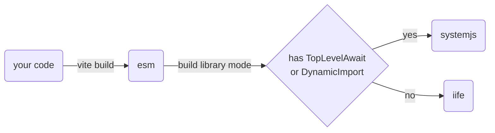

# Next

## features

- support `top level await` by systemjs
- support `dynamic import` in single file by systemjs
- use original build mode instead of library-mode
- vite legacy is available



## breaking change

- vite-plugin-monkey must be the `last one` of plugin list
- sourcemap is `temporarily` unavailable

## example

when plugin works with vite legacy, it is necessary to set `renderLegacyChunks=false`

```ts
// vite.config.ts
import legacy from '@vitejs/plugin-legacy';
import { defineConfig } from 'vite';
import monkey from 'vite-plugin-monkey';

export default defineConfig({
  plugins: [
    legacy({
      renderLegacyChunks: false,
      modernPolyfills: true,
    }),
    monkey({
      entry: './src/main2.ts',
    }),
  ],
});
```
