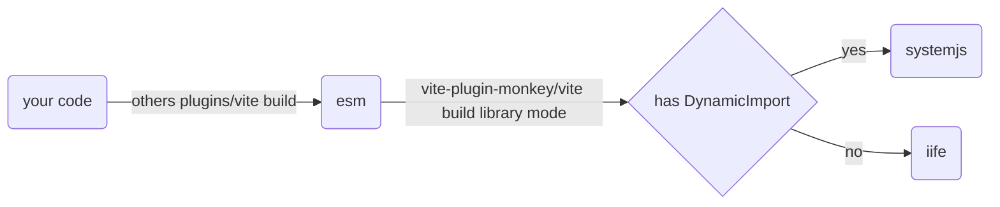

# vite-plugin-monkey

<p>
  <a href="https://www.npmjs.com/package/vite-plugin-monkey"></a>
  <a href="https://github.com/lisonge/vite-plugin-monkey/releases/"></a>
</p>

[README](README.md) | [中文文档](README_zh.md)

A vite plugin server and build your.user.js for userscript engine like [Tampermonkey](https://www.tampermonkey.net/) and [Violentmonkey](https://violentmonkey.github.io/), [Greasemonkey](https://www.greasespot.net/), [ScriptCat](https://docs.scriptcat.org/)

## Feature

- support Tampermonkey, Violentmonkey, Greasemonkey, ScriptCat, etc
- inject userscript comment to build bundle
- auto open \*.user.js in default browser when userscript change
- external cdn url inject to userscript @require
- external module inject to userscript @resource
- use GM_api by ESM import with type hints
- intelligently collect GM_api that is used and automatically configure userscript @grant comment
- support `top level await` and `dynamic import` in single file
- when vite preview, auto open browser install dist.user.js
- full typescript support and vite feature

## Quick Start

just like vite create

```shell
pnpm create monkey
# npm create monkey
# yarn create monkey
```

then you can choose the following template

| JavaScript                                                     | TypeScript                                                           |
| -------------------------------------------------------------- | -------------------------------------------------------------------- |
| [empty](/packages/create-monkey/template-empty) (only js)      | [empty-ts](/packages/create-monkey/template-empty-ts) (only ts)      |
| [vanilla](/packages/create-monkey/template-vanilla) (js + css) | [vanilla-ts](/packages/create-monkey/template-vanilla-ts) (ts + css) |
| [vue](/packages/create-monkey/template-vue)                    | [vue-ts](/packages/create-monkey/template-vue-ts)                    |
| [react](/packages/create-monkey/template-react)                | [react-ts](/packages/create-monkey/template-react-ts)                |
| [preact](/packages/create-monkey/template-preact)              | [preact-ts](/packages/create-monkey/template-preact-ts)              |
| [svelte](/packages/create-monkey/template-svelte)              | [svelte-ts](/packages/create-monkey/template-svelte-ts)              |
| [solid](/packages/create-monkey/template-solid)                | [solid-ts](/packages/create-monkey/template-solid-ts)                |

<details open>
  <summary>Sample: Initializing a Template</summary>


</details>

<details open>
  <summary>Sample: Hot Module Replacement</summary>


</details>

<details open>
  <summary>Sample: Build & Preview</summary>


</details>

## Installation

```shell
pnpm add -D vite-plugin-monkey
# npm i -D vite-plugin-monkey
# yarn add -D vite-plugin-monkey
```

note: vite-plugin-monkey must be the `last item` of plugin list



## Config

<!-- template-start-MonkeyOption -->

[MonkeyOption](/packages/vite-plugin-monkey/src/node/types.ts#L120)

<details open>
  <summary>MonkeyOption Type</summary>

```ts
export type MonkeyOption = {
  /**
   * userscript entry file path
   */
  entry: string;
  userscript?: MonkeyUserScript;
  format?: Format;

  /**
   * alias of vite-plugin-monkey/dist/client
   * @default '$'
   * @example
   * // vite-env.d.ts for type hint
   *
   * // if you use default value `$`
   * /// <reference types="vite-plugin-monkey/client" />
   *
   * // if you use other_alias
   * declare module other_alias {
   *   export * from 'vite-plugin-monkey/dist/client';
   * }
   */
  clientAlias?: string;
  server?: {
    /**
     * auto open install url in default browser when userscript comment change
     *
     * and set `viteConfig.server.open ??= monkeyConfig.server.open`
     * @default
     * process.platform == 'win32' || process.platform == 'darwin' // if platform is Win/Mac
     */
    open?: boolean;

    /**
     * name prefix, distinguish server.user.js and build.user.js in monkey extension install list, if you not want prefix, set false
     * @default 'server:'
     */
    prefix?: string | ((name: string) => string) | false;

    /**
     * mount GM_api to unsafeWindow, not recommend it, you should use GM_api by ESM import, or use [unplugin-auto-import](https://github.com/antfu/unplugin-auto-import)
     * @default false
     * @example
     * // if set true, you can use `vite-plugin-monkey/global` for type hint
     * // vite-env.d.ts
     * /// <reference types="vite-plugin-monkey/global" />
     */
    mountGmApi?: boolean;
  };
  build?: {
    /**
     * build bundle userscript file name
     *
     * it should end with '.user.js'
     * @default (package.json.name??'monkey')+'.user.js'
     */
    fileName?: string;

    /**
     * build bundle userscript comment file name, this file is only include comment
     *
     * it can be used by userscript.updateURL, when checking for updates, just download this small file instead of downloading the entire script
     *
     * it should end with '.meta.js', if set false, will not generate this file
     *
     * if set true, will equal to fileName.replace(/\\.user\\.js$/,'.meta.js')
     *
     * @default false
     */
    metaFileName?: string | boolean | ((fileName: string) => string);

    /**
     * this config can be array or object, array=Object.entries(object)
     *
     * if value is string or function, it or its return value is exportVarName
     *
     * if value is Array, the first [item or its return value] is exportVarName, the items after it all are url that is [require url]
     *
     * if module is unimported, plugin will not add require url to userscript
     *
     * @example
     * { // map structure
     *  vue:'Vue',
     *  // if set this
     *  // you need manually set userscript.require = ['https://unpkg.com/vue@3.0.0/dist/vue.global.js'], when `vite build`
     *
     *  vuex:['Vuex', (version, name)=>`https://unpkg.com/${name}@${version}/dist/vuex.global.js`],
     *  // plugin will auto add this url to userscript.require
     *
     *  'prettier/parser-babel': [
     *    'prettierPlugins.babel',
     *    (version, name, importName) => {
     *      // name == `prettier`
     *      // importName == `prettier/parser-babel`
     *      const subpath = `${importName.split('/').at(-1)}.js`;
     *      return `https://cdn.jsdelivr.net/npm/${name}@${version}/${subpath}`;
     *    },
     *  ],
     *  // sometimes importName deffers from package name
     * }
     * @example
     * [ // array structure, this example come from [playground/ex-vue-demi](https://github.com/lisonge/vite-plugin-monkey/tree/main/playground/ex-vue-demi)
     *   [
     *     'vue',
     *     cdn
     *       .jsdelivr('Vue', 'dist/vue.global.prod.js')
     *       .concat('https://unpkg.com/vue-demi@latest/lib/index.iife.js')
     *       .concat(
     *         await util.fn2dataUrl(() => {
     *           window.Vue = Vue;
     *         }),
     *       ),
     *   ],
     *   ['pinia', cdn.jsdelivr('Pinia', 'dist/pinia.iife.prod.js')],
     *   [
     *     'element-plus',
     *     cdn.jsdelivr('ElementPlus', 'dist/index.full.min.js'),
     *   ],
     * ]
     */
    externalGlobals?: ExternalGlobals;

    /**
     * according to final code bundle, auto inject GM_* or GM.* to userscript comment grant
     *
     * tree shaking code, then if code.includes('GM_xxx'), add \@grant GM_xxx to userscript
     * @default true
     */
    autoGrant?: boolean;

    /**
     * @deprecated use [viteConfig.build.cssMinify](https://vitejs.dev/config/build-options.html#build-cssminify) in vite>=4.2.0
     *
     * now minifyCss will not work
     */
    minifyCss?: boolean;

    /**
     * @example
     * {  // resourceName default value is pkg.importName
     *   'element-plus/dist/index.css': pkg=>`https://unpkg.com/${pkg.name}@${pkg.version}/${pkg.resolveName}`,
     *   'element-plus/dist/index.css': {
     *     resourceName: pkg=>pkg.importName,
     *     resourceUrl: pkg=>`https://unpkg.com/${pkg.name}@${pkg.version}/${pkg.resolveName}`,
     *     loader: pkg=>{ // there are default loaders that support [css, json, the assets that vite support, ?url, ?raw] file/name suffix
     *        const css = GM_getResourceText(pkg.resourceName);
     *        GM_addStyle(css);
     *        return css;
     *     },
     *     nodeLoader: pkg=>{
     *        return [
     *          `export default (()=>{`,
     *          `const css = GM_getResourceText(${JSON.stringify(pkg.resourceName)});`,
     *          `GM_addStyle(css);`,
     *          `return css;`,
     *          `})();`
     *        ].join('');
     *     },
     *   },
     *   'element-plus/dist/index.css': [
     *      (version, name, importName, resolveName)=>importName,
     *      (version, name, importName, resolveName)=>`https://unpkg.com/${name}@${version}/${resolveName}`,
     *       // for compat externalGlobals cdn function, if (version/name/importName/resolveName) == '', plugin will use their own default values
     *   ],
     *   'element-plus/dist/index.css': cdn.jsdelivr(),
     * }
     */
    externalResource?: ExternalResource;

    /**
     * when use dynamic-import, plugin will use systemjs build your code
     *
     * `cdn.jsdelivr()[1]` example -> [dynamic-import.user.js](https://github.com/lisonge/vite-plugin-monkey/blob/7645b185605faf9b48c43116db5ea01726188e03/playground/dynamic-import/dist/dynamic-import.user.js)
     *
     * `'inline'` exmple -> [test-v3.user.js](https://github.com/lisonge/vite-plugin-monkey/blob/7645b185605faf9b48c43116db5ea01726188e03/playground/test-v3/dist/test-v3.user.js)
     *
     * @default
     * cdn.jsdelivr()[1]
     */
    systemjs?: 'inline' | ModuleToUrlFc;

    /**
     * @default
     * const defaultFc = () => {
     *   return (e: string) => {
     *     if (typeof GM_addStyle == 'function') {
     *       GM_addStyle(e);
     *       return;
     *     }
     *     const o = document.createElement('style');
     *     o.textContent = e;
     *     document.head.append(o);
     *   };
     * };
     * @example
     * const defaultFc1 = () => {
     *   return (e: string) => {
     *     const o = document.createElement('style');
     *     o.textContent = e;
     *     document.head.append(o);
     *   };
     * };
     * const defaultFc2 = (css:string)=>{
     *   const t = JSON.stringify(css)
     *   return `(e=>{const o=document.createElement("style");o.textContent=e,document.head.append(o)})(${t})`
     * }
     */
    cssSideEffects?: (
      css: string,
    ) => IPromise<string | ((css: string) => void)>;
  };
};
```

</details>

<!-- template-end-MonkeyOption -->

## CDN util for external

```ts
import { defineConfig } from 'vite';
import monkey, { cdn } from 'vite-plugin-monkey';
export default defineConfig({
  plugins: [
    monkey({
      build: {
        externalGlobals: {
          react: cdn.jsdelivr('React', 'umd/react.production.min.js'),
        },
        externalResource: {
          'element-plus/dist/index.css': cdn.jsdelivr(),
        },
      },
    }),
  ],
});
```

there is the following cdn to use, full detail see [cdn.ts](/packages/vite-plugin-monkey/src/node/cdn.ts)

- [jsdelivr](https://www.jsdelivr.com/)
- [unpkg](https://unpkg.com/)
- [bytecdntp](https://cdn.bytedance.com/)
- [baomitu](https://cdn.baomitu.com/)
- [cdnjs](https://cdnjs.com/libraries)
- [zhimg](https://unpkg.zhimg.com/)
- [npmmirror](https://registry.npmmirror.com/)

if you want use other cdn, you can see [external-scripts](https://greasyfork.org/help/external-scripts)

## Minify

because of the [code-rules](https://greasyfork.org/en/help/code-rules) of greasyfork

> Code posted to Greasy Fork must not be obfuscated or minified

so plugin will change the default value of [viteConfig.build.minify](https://cn.vitejs.dev/config/build-options.html#build-minify) to `false`

if you want to enable minify, just set `viteConfig.build.minify=true`

## GM_api usage

### ESM usage

we can use GM_api by esm module

```ts
// main.ts
import { GM_cookie, unsafeWindow, monkeyWindow, GM_addElement } from '$';
// $ is the default alias of vite-plugin-monkey/dist/client
// if you want use 'others', set monkeyConfig.clientAlias='others'

// whatever it is serve or build mode, monkeyWindow is always the window of [UserScript Scope]
console.log(monkeyWindow);

GM_addElement(document.body, 'div', { innerHTML: 'hello' });

// whatever it is serve or build mode, unsafeWindow is always host window
if (unsafeWindow == window) {
  console.log('scope->host, host esm scope');
} else {
  console.log('scope->monkey, userscript scope');
}

GM_cookie.list({}, (cookies, error) => {
  if (error) {
    console.log(error);
  } else {
    const [cookie] = cookies;
    if (cookie) {
      console.log(cookie);
    }
  }
});
```

### Global variables usage

set `monkeyConfig.server.mountGmApi=true`

```ts
// vite.config.ts
import { defineConfig } from 'vite';
import monkey from 'vite-plugin-monkey';

export default defineConfig({
  plugins: [
    monkey({
      // ...
      server: { mountGmApi: true },
    }),
  ],
});
```

GM_api will mount to the property of `host window/globalThis`

```ts
// main.ts
console.log(GM_cookie == globalThis.GM_cookie);
console.log({ GM_cookie, unsafeWindow, monkeyWindow, GM_addElement });
```

### Auto import usage

use [unplugin-auto-import](https://github.com/antfu/unplugin-auto-import)

```ts
// vite.config.ts
import { defineConfig } from 'vite';
import monkey, { util } from 'vite-plugin-monkey';
import AutoImport from 'unplugin-auto-import/vite';

export default defineConfig({
  plugins: [
    AutoImport({
      imports: [util.unimportPreset],
    }),
    monkey({
      // ...
    }),
  ],
});
```

```ts
// main.ts
// auto import example
console.log({ GM_cookie, unsafeWindow, monkeyWindow, GM_addElement });
```

## Example

test examples, see [/playground](/playground)

and preact/react/svelte/vanilla/vue/solid examples, see [create-monkey](/packages/create-monkey)

## Some note

### Work with other plugins

plugin will rebuild your code by [generateBundle](https://rollupjs.org/plugin-development/#generatebundle) hook

please ensure that the order of the plugin is **the last one**

### [CSP](https://developer.mozilla.org/en-US/docs/Web/HTTP/CSP)

in `vite serve` mode, the code entry is added as script to target host document.head, code need work between two origins

but the browser will prevent the execution of this script according to the CSP strategy

now just use browser extension [Disable-CSP](https://github.com/lisonge/Disable-CSP)

### Mixed IIFE and UMD at @require

the variable declared by `var` from iife-cdn will not become the property of window at monkeyWindow scope, because monkeyWindow scope is not global scope

so if an umd lib is dependent on an iife lib, such as `element-plus` is dependent on `vue`, `element-plus` cdn will not work

detail see [issues/5](https://github.com/lisonge/vite-plugin-monkey/issues/5) or [greasyfork#1084](https://github.com/JasonBarnabe/greasyfork/issues/1084)

the solution is that we append a dataUrl script that will set iife-variable as the property of window after iife-cdn

```ts
import { defineConfig } from 'vite';
import monkey, { cdn, util } from 'vite-plugin-monkey';

export default defineConfig(async ({ command, mode }) => ({
  plugins: [
    monkey({
      // ...
      build: {
        externalGlobals: {
          vue: cdn
            .jsdelivr('Vue', 'dist/vue.global.prod.js')
            .concat(util.dataUrl(';window.Vue=Vue;')),
          'element-plus': cdn.jsdelivr('ElementPlus', 'dist/index.full.min.js'),
        },
      },
    }),
  ],
}));
```

### Polyfill

when plugin works with vite legacy, it is necessary to set `renderLegacyChunks=false`

```ts
// vite.config.ts
import legacy from '@vitejs/plugin-legacy';
import { defineConfig } from 'vite';
import monkey from 'vite-plugin-monkey';

export default defineConfig({
  plugins: [
    legacy({
      renderLegacyChunks: false,
      modernPolyfills: true,
    }),
    monkey({
      entry: './src/main.ts',
    }),
  ],
});
```

## How to Properly Build a Library Using GM_api

If you want to encapsulate GM_api to build a library for others to use

The previous practice generally involved accessing GM_api as a global variable directly in the library code and then referencing and loading it in userscript through `@require`.

However, this approach does not allow us to manage this dependency through npm or other package managers, and it is not compatible with the usage of ESM GM_api in vite-plugin-monkey.

Now, you only need to import GM_api normally from `vite-plugin-monkey/dist/client` in your library code. Modify your build config and exclude `vite-plugin-monkey/dist/client`.

This way, you can build a library that can be used in vite-plugin-monkey. Users of this library only need to install it via npm and use it normally with `import`.

Of course, if you directly bundle `vite-plugin-monkey/dist/client` into the build artifact, the library can also be referenced directly through `@require`.

However, to make the build artifact more concise, it is recommended that you redirect `vite-plugin-monkey/dist/client` to `vite-plugin-monkey/dist/native` during the build.

Below is an example using tsup to simultaneously package ESM and IIFE formats. ESM is provided to vite-plugin-monkey users, and IIFE is provided to users who want to reference it through `@require`.

Additionally, the IIFE format can also be used as a configuration for vite-plugin-monkey's externalGlobals to reduce the size of the build artifact.

```ts
// /src/index.ts
import { GM_setValue } from 'vite-plugin-monkey/dist/client';

export const setValue = (name: string, value: unknown) => {
  console.log('you invoke setValue', name, value);
  GM_setValue(name, value);
};
```

```ts
// tsup.config.ts
import { defineConfig } from 'tsup';

const outExtension = (ctx: { format: 'esm' | 'cjs' | 'iife' }) => ({
  js: { esm: '.mjs', cjs: '.cjs', iife: '.iife.js' }[ctx.format],
});

export default defineConfig([
  {
    // for vite import
    entry: ['src/index.ts'],
    outDir: 'dist',
    sourcemap: true,
    platform: 'browser',
    outExtension,
    dts: true,
    format: ['esm'],
    external: ['vite-plugin-monkey/dist/client'],
  },
  {
    // for userscript @require
    entry: ['src/index.ts'],
    outDir: 'dist',
    sourcemap: true,
    platform: 'browser',
    outExtension,
    dts: false,
    format: ['iife'],
    minify: true,
    globalName: `GmExtra`,
    target: 'es2015',
    esbuildOptions: (options) => {
      options.alias = {
        'vite-plugin-monkey/dist/client': 'vite-plugin-monkey/dist/native',
      };
    },
  },
]);
```

## Contribution

please commit your changes to [dev](https://github.com/lisonge/vite-plugin-monkey/tree/dev) branch
