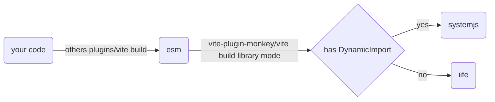

# vite-plugin-monkey

<p>
  <a href="https://www.npmjs.com/package/vite-plugin-monkey"></a>
  <a href="https://github.com/lisonge/vite-plugin-monkey/releases/"></a>
</p>

[README](README.md) | [中文文档](README_zh.md)

一个 vite 插件，用来辅助开发 [Tampermonkey](https://www.tampermonkey.net/), [Violentmonkey](https://violentmonkey.github.io/), [Greasemonkey](https://www.greasespot.net/), [ScriptCat](https://docs.scriptcat.org/) 等脚本引擎 的脚本

## 主要特性

- 支持 Tampermonkey、Violentmonkey、Greasemonkey、ScriptCat 等脚本引擎的辅助开发
- 打包自动注入脚本配置头部注释
- 当第一次启动或脚本配置注释改变时自动在默认浏览器打开脚本安装
- 利用 @require 配置库的 CDN 的方案，减少构建脚本大小
- 利用 @resource 配置外部资源 CDN 的方案，额外减少构建脚本大小
- 通过 ESM 导入的方式使用 GM_api，附带类型提示
- 智能收集使用到的 GM_api，自动配置 @grant 注释
- 支持 `top level await` 和单文件下的 `dynamic import`
- 预览模式下自动打开浏览器安装构建好的脚本
- 完全的 Typescript 和 Vite 的开发体验，比如模块热替换，秒启动

## 快速开始

使用方式与 vite create 一致

```shell
pnpm create monkey
# npm create monkey
# yarn create monkey
```

然后你能从以下模板选择

| JavaScript                                                     | TypeScript                                                           |
| -------------------------------------------------------------- | -------------------------------------------------------------------- |
| [empty](/packages/create-monkey/template-empty) (only js)      | [empty-ts](/packages/create-monkey/template-empty-ts) (only ts)      |
| [vanilla](/packages/create-monkey/template-vanilla) (js + css) | [vanilla-ts](/packages/create-monkey/template-vanilla-ts) (ts + css) |
| [vue](/packages/create-monkey/template-vue)                    | [vue-ts](/packages/create-monkey/template-vue-ts)                    |
| [react](/packages/create-monkey/template-react)                | [react-ts](/packages/create-monkey/template-react-ts)                |
| [preact](/packages/create-monkey/template-preact)              | [preact-ts](/packages/create-monkey/template-preact-ts)              |
| [svelte](/packages/create-monkey/template-svelte)              | [svelte-ts](/packages/create-monkey/template-svelte-ts)              |
| [solid](/packages/create-monkey/template-solid)                | [solid-ts](/packages/create-monkey/template-solid-ts)                |

<details open>
  <summary>示例: 初始化模板</summary>


</details>

<details open>
  <summary>示例: 模块热替换</summary>


</details>

<details open>
  <summary>示例: 构建&预览</summary>


</details>

## 单独安装

```shell
pnpm add -D vite-plugin-monkey
# npm i -D vite-plugin-monkey
# yarn add -D vite-plugin-monkey
```

注意: vite-plugin-monkey 必须是插件列表的最后一项



## 配置

[MonkeyOption](/packages/vite-plugin-monkey/src/node/types.ts#L120)

<details open>
  <summary>MonkeyOption Type</summary>

```ts
export type MonkeyOption = {
  /**
   * userscript entry file path
   */
  entry: string;
  userscript?: MonkeyUserScript;
  format?: Format;

  /**
   * alias of vite-plugin-monkey/dist/client
   * @default '$'
   * @example
   * // vite-env.d.ts for type hint
   *
   * // if you use default value `$`
   * /// <reference types="vite-plugin-monkey/client" />
   *
   * // if you use other_alias
   * declare module other_alias {
   *   export * from 'vite-plugin-monkey/dist/client';
   * }
   */
  clientAlias?: string;
  server?: {
    /**
     * auto open install url in default browser when userscript comment change
     *
     * and set `viteConfig.server.open ??= monkeyConfig.server.open`
     * @default
     * process.platform == 'win32' || process.platform == 'darwin' // if platform is Win/Mac
     */
    open?: boolean;

    /**
     * name prefix, distinguish server.user.js and build.user.js in monkey extension install list, if you not want prefix, set false
     * @default 'server:'
     */
    prefix?: string | ((name: string) => string) | false;

    /**
     * mount GM_api to unsafeWindow, not recommend it, you should use GM_api by ESM import, or use [unplugin-auto-import](https://github.com/antfu/unplugin-auto-import)
     * @default false
     * @example
     * // if set true, you can use `vite-plugin-monkey/global` for type hint
     * // vite-env.d.ts
     * /// <reference types="vite-plugin-monkey/global" />
     */
    mountGmApi?: boolean;
  };
  build?: {
    /**
     * build bundle userscript file name
     *
     * it should end with '.user.js'
     * @default (package.json.name??'monkey')+'.user.js'
     */
    fileName?: string;

    /**
     * build bundle userscript comment file name, this file is only include comment
     *
     * it can be used by userscript.updateURL, when checking for updates, just download this small file instead of downloading the entire script
     *
     * it should end with '.meta.js', if set false, will not generate this file
     *
     * if set true, will equal to fileName.replace(/\\.user\\.js$/,'.meta.js')
     *
     * @default false
     */
    metaFileName?: string | boolean | ((fileName: string) => string);

    /**
     * this config can be array or object, array=Object.entries(object)
     *
     * if value is string or function, it or its return value is exportVarName
     *
     * if value is Array, the first [item or its return value] is exportVarName, the items after it all are url that is [require url]
     *
     * if module is unimported, plugin will not add require url to userscript
     *
     * @example
     * { // map structure
     *  vue:'Vue',
     *  // if set this
     *  // you need manually set userscript.require = ['https://unpkg.com/vue@3.0.0/dist/vue.global.js'], when `vite build`
     *
     *  vuex:['Vuex', (version, name)=>`https://unpkg.com/${name}@${version}/dist/vuex.global.js`],
     *  // plugin will auto add this url to userscript.require
     *
     *  'prettier/parser-babel': [
     *    'prettierPlugins.babel',
     *    (version, name, importName) => {
     *      // name == `prettier`
     *      // importName == `prettier/parser-babel`
     *      const subpath = `${importName.split('/').at(-1)}.js`;
     *      return `https://cdn.jsdelivr.net/npm/${name}@${version}/${subpath}`;
     *    },
     *  ],
     *  // sometimes importName deffers from package name
     * }
     * @example
     * [ // array structure, this example come from [playground/ex-vue-demi](https://github.com/lisonge/vite-plugin-monkey/tree/main/playground/ex-vue-demi)
     *   [
     *     'vue',
     *     cdn
     *       .jsdelivr('Vue', 'dist/vue.global.prod.js')
     *       .concat('https://unpkg.com/vue-demi@latest/lib/index.iife.js')
     *       .concat(
     *         await util.fn2dataUrl(() => {
     *           window.Vue = Vue;
     *         }),
     *       ),
     *   ],
     *   ['pinia', cdn.jsdelivr('Pinia', 'dist/pinia.iife.prod.js')],
     *   [
     *     'element-plus',
     *     cdn.jsdelivr('ElementPlus', 'dist/index.full.min.js'),
     *   ],
     * ]
     */
    externalGlobals?: ExternalGlobals;

    /**
     * according to final code bundle, auto inject GM_* or GM.* to userscript comment grant
     *
     * tree shaking code, then if code.includes('GM_xxx'), add \@grant GM_xxx to userscript
     * @default true
     */
    autoGrant?: boolean;

    /**
     * @deprecated use [viteConfig.build.cssMinify](https://vitejs.dev/config/build-options.html#build-cssminify) in vite>=4.2.0
     *
     * now minifyCss will not work
     */
    minifyCss?: boolean;

    /**
     * @example
     * {  // resourceName default value is pkg.importName
     *   'element-plus/dist/index.css': pkg=>`https://unpkg.com/${pkg.name}@${pkg.version}/${pkg.resolveName}`,
     *   'element-plus/dist/index.css': {
     *     resourceName: pkg=>pkg.importName,
     *     resourceUrl: pkg=>`https://unpkg.com/${pkg.name}@${pkg.version}/${pkg.resolveName}`,
     *     loader: pkg=>{ // there are default loaders that support [css, json, the assets that vite support, ?url, ?raw] file/name suffix
     *        const css = GM_getResourceText(pkg.resourceName);
     *        GM_addStyle(css);
     *        return css;
     *     },
     *     nodeLoader: pkg=>{
     *        return [
     *          `export default (()=>{`,
     *          `const css = GM_getResourceText(${JSON.stringify(pkg.resourceName)});`,
     *          `GM_addStyle(css);`,
     *          `return css;`,
     *          `})();`
     *        ].join('');
     *     },
     *   },
     *   'element-plus/dist/index.css': [
     *      (version, name, importName, resolveName)=>importName,
     *      (version, name, importName, resolveName)=>`https://unpkg.com/${name}@${version}/${resolveName}`,
     *       // for compat externalGlobals cdn function, if (version/name/importName/resolveName) == '', plugin will use their own default values
     *   ],
     *   'element-plus/dist/index.css': cdn.jsdelivr(),
     * }
     */
    externalResource?: ExternalResource;

    /**
     * when use dynamic-import, plugin will use systemjs build your code
     *
     * `cdn.jsdelivr()[1]` example -> [dynamic-import.user.js](https://github.com/lisonge/vite-plugin-monkey/blob/7645b185605faf9b48c43116db5ea01726188e03/playground/dynamic-import/dist/dynamic-import.user.js)
     *
     * `'inline'` exmple -> [test-v3.user.js](https://github.com/lisonge/vite-plugin-monkey/blob/7645b185605faf9b48c43116db5ea01726188e03/playground/test-v3/dist/test-v3.user.js)
     *
     * @default
     * cdn.jsdelivr()[1]
     */
    systemjs?: 'inline' | ModuleToUrlFc;

    /**
     * @default
     * const defaultFc = () => {
     *   return (e: string) => {
     *     if (typeof GM_addStyle == 'function') {
     *       GM_addStyle(e);
     *       return;
     *     }
     *     const o = document.createElement('style');
     *     o.textContent = e;
     *     document.head.append(o);
     *   };
     * };
     * @example
     * const defaultFc1 = () => {
     *   return (e: string) => {
     *     const o = document.createElement('style');
     *     o.textContent = e;
     *     document.head.append(o);
     *   };
     * };
     * const defaultFc2 = (css:string)=>{
     *   const t = JSON.stringify(css)
     *   return `(e=>{const o=document.createElement("style");o.textContent=e,document.head.append(o)})(${t})`
     * }
     */
    cssSideEffects?: (
      css: string,
    ) => IPromise<string | ((css: string) => void)>;
  };
};
```

## 排除依赖的 CDN 工具

```ts
import { defineConfig } from 'vite';
import monkey, { cdn } from 'vite-plugin-monkey';
export default defineConfig({
  plugins: [
    monkey({
      build: {
        externalGlobals: {
          react: cdn.jsdelivr('React', 'umd/react.production.min.js'),
        },
        externalResource: {
          'element-plus/dist/index.css': cdn.jsdelivr(),
        },
      },
    }),
  ],
});
```

有以下 CDN 可使用，详情见 [cdn.ts](/packages/vite-plugin-monkey/src/node/cdn.ts)

- [jsdelivr](https://www.jsdelivr.com/)
- [unpkg](https://unpkg.com/)
- [bytecdntp](https://cdn.bytedance.com/)
- [baomitu](https://cdn.baomitu.com/)
- [cdnjs](https://cdnjs.com/libraries)
- [zhimg](https://unpkg.zhimg.com/)
- [npmmirror](https://registry.npmmirror.com/)

如果你想使用其他 CDN，请查看 [external-scripts](https://greasyfork.org/zh-CN/help/external-scripts)

## 压缩混淆

由于 greasyfork 的 [代码规则](https://greasyfork.org/zh-CN/help/code-rules)

> 提交到 Greasy Fork 的代码不得混淆或最小化

因此插件将 [viteConfig.build.minify](https://cn.vitejs.dev/config/build-options.html#build-minify) 的默认值更改为 `false`

如果你想启用压缩混淆，只需要手动设置 `viteConfig.build.minify=true`

## GM_api 用法

### ESM 用法

我们可以通过 ESM 模块来使用 GM_api

```ts
// main.ts
import { GM_cookie, unsafeWindow, monkeyWindow, GM_addElement } from '$';
// $ is the default alias of vite-plugin-monkey/dist/client
// if you want use 'others', set monkeyConfig.clientAlias='others'

// whatever it is serve or build mode, monkeyWindow is always the window of [UserScript Scope]
console.log(monkeyWindow);

GM_addElement(document.body, 'div', { innerHTML: 'hello' });

// whatever it is serve or build mode, unsafeWindow is always host window
if (unsafeWindow == window) {
  console.log('scope->host, host esm scope');
} else {
  console.log('scope->monkey, userscript scope');
}

GM_cookie.list({}, (cookies, error) => {
  if (error) {
    console.log(error);
  } else {
    const [cookie] = cookies;
    if (cookie) {
      console.log(cookie);
    }
  }
});
```

### 全局变量用法

先配置 `monkeyConfig.server.mountGmApi=true`

```ts
// vite.config.ts
import { defineConfig } from 'vite';
import monkey from 'vite-plugin-monkey';

export default defineConfig({
  plugins: [
    monkey({
      // ...
      server: { mountGmApi: true },
    }),
  ],
});
```

GM_api 将会变成宿主域的全局变量，可以在任意作用域访问

```ts
// main.ts
console.log(GM_cookie == globalThis.GM_cookie);
console.log({ GM_cookie, unsafeWindow, monkeyWindow, GM_addElement });
```

### 自动导入用法

配置插件 [unplugin-auto-import](https://github.com/antfu/unplugin-auto-import)

```ts
// vite.config.ts
import { defineConfig } from 'vite';
import monkey, { util } from 'vite-plugin-monkey';
import AutoImport from 'unplugin-auto-import/vite';

export default defineConfig({
  plugins: [
    AutoImport({
      imports: [util.unimportPreset],
    }),
    monkey({
      // ...
    }),
  ],
});
```

```ts
// main.ts
// auto import example
console.log({ GM_cookie, unsafeWindow, monkeyWindow, GM_addElement });
```

## 例子

测试例子，请直接看 [/playground](/playground)

preact/react/svelte/vanilla/vue/solid 的例子，请直接看 [create-monkey](/packages/create-monkey)

## 注意

### 和其他插件一起使用

插件将通过 [generateBundle](https://rollupjs.org/plugin-development/#generatebundle) 重新构建你的代码

请尽量确保插件的顺序是**最后一个**

### [CSP](https://developer.mozilla.org/en-US/docs/Web/HTTP/CSP)

在 `vite serve` 模式下，代码入口被作为 script 添加到目标环境 document.head，代码需要在两个源之间正常工作

但是浏览器会根据 CSP 策略阻止这个 script 的执行

安装扩展 [Disable-CSP](https://github.com/lisonge/Disable-CSP) 即可禁用 CSP

### 通过 @require 加载的 IIFE 和 UMD 混用的问题

iife-cdn 使用 `var` 声明的变量在油猴脚本作用域下不会成为 window 的属性

因此如果一个 umd 库依赖了一个 iife 库， 例如 `element-plus` 依赖 `vue`，`element-plus` cdn 在这种情况下无法正常运行

详情见 [issues/5](https://github.com/lisonge/vite-plugin-monkey/issues/5) 或 [greasyfork#1084](https://github.com/JasonBarnabe/greasyfork/issues/1084)

解决方法是 在 iife-cdn 后面追加一个 `dataUrl` 脚本，把 iife 声明的变量作为 `window` 的属性

```js
// 解决方案例子
import { cdn, util } from 'vite-plugin-monkey';
const buildConfig = {
  vue: cdn
    .jsdelivr('Vue', 'dist/vue.global.prod.js')
    .concat(util.dataUrl(';window.Vue=Vue;')),
  'element-plus': cdn.jsdelivr('ElementPlus', 'dist/index.full.min.js'),
};
```

### Polyfill

与 vite legacy 一起使用时，需要设置 `renderLegacyChunks=false`

```ts
// vite.config.ts
import legacy from '@vitejs/plugin-legacy';
import { defineConfig } from 'vite';
import monkey from 'vite-plugin-monkey';

export default defineConfig({
  plugins: [
    legacy({
      renderLegacyChunks: false,
      modernPolyfills: true,
    }),
    monkey({
      entry: './src/main.ts',
    }),
  ],
});
```

## 如何正确构建一个使用 GM_api 的库

如果您想封装 GM_api 构建一个库后给其他人使用

以前的做法一般是直接在库代码里将 GM_api 作为全局变量访问，然后通过 `@require` 在脚本里引用加载

但是这无法让我们通过 npm 等包管理器去管理这个依赖，也不适配 vite-plugin-monkey 的 ESM GM_api 的用法

现在您只需要在您的库代码里正常从 `vite-plugin-monkey/dist/client` 导入 GM_api，然后在打包的时候将 `vite-plugin-monkey/dist/client` 作为排除依赖即可

这样您就能构建一个正常在 vite-plugin-monkey 里使用的库，用户使用这个库只需要使用 npm 安装后正常 `import` 使用即可

当然如果您直接将 `vite-plugin-monkey/dist/client` 打包到构建产物中，这个库也能直接通过 `@require` 引用

但是为了使构建产物更加简洁，建议您在构建的时候将 `vite-plugin-monkey/dist/client` 重定向到 `vite-plugin-monkey/dist/native`

以下是一个使用 tsup 同时打包 ESM 和 IIFE 格式的例子，ESM 提供给 vite-plugin-monkey 用户，IIFE 提供给想通过 `@require` 引用的用户

同时 IIFE 格式也能作为 vite-plugin-monkey 的 `externalGlobals` 的配置来减少构建产物的大小

```ts
// /src/index.ts
import { GM_setValue } from 'vite-plugin-monkey/dist/client';

export const setValue = (name: string, value: unknown) => {
  console.log('you invoke setValue', name, value);
  GM_setValue(name, value);
};
```

```ts
// tsup.config.ts
import { defineConfig } from 'tsup';

const outExtension = (ctx: { format: 'esm' | 'cjs' | 'iife' }) => ({
  js: { esm: '.mjs', cjs: '.cjs', iife: '.iife.js' }[ctx.format],
});

export default defineConfig([
  {
    // for vite import
    entry: ['src/index.ts'],
    outDir: 'dist',
    sourcemap: true,
    platform: 'browser',
    outExtension,
    dts: true,
    format: ['esm'],
    external: ['vite-plugin-monkey/dist/client'],
  },
  {
    // for userscript @require
    entry: ['src/index.ts'],
    outDir: 'dist',
    sourcemap: true,
    platform: 'browser',
    outExtension,
    dts: false,
    format: ['iife'],
    minify: true,
    globalName: `GmExtra`,
    target: 'es2015',
    esbuildOptions: (options) => {
      options.alias = {
        'vite-plugin-monkey/dist/client': 'vite-plugin-monkey/dist/native',
      };
    },
  },
]);
```

## 贡献

请提交你的修改到 [dev](https://github.com/lisonge/vite-plugin-monkey/tree/dev) 分支
