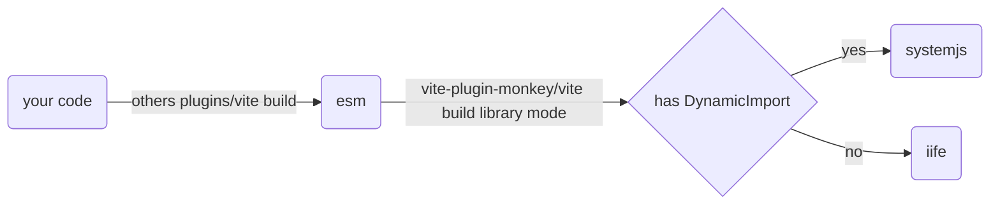

# 开始使用

## 创建项目

使用方式与 vite create 一致

```shell
pnpm create monkey
# npm create monkey
# yarn create monkey
```

然后你能从以下模板选择

| JavaScript                                                                                                   | TypeScript                                                                                                         |
| ------------------------------------------------------------------------------------------------------------ | ------------------------------------------------------------------------------------------------------------------ |
| [empty](https://github.com/lisonge/vite-plugin-monkey/tree/main/create-monkey/template-empty) (only js)      | [empty-ts](https://github.com/lisonge/vite-plugin-monkey/tree/main/create-monkey/template-empty-ts) (only ts)      |
| [vanilla](https://github.com/lisonge/vite-plugin-monkey/tree/main/create-monkey/template-vanilla) (js + css) | [vanilla-ts](https://github.com/lisonge/vite-plugin-monkey/tree/main/create-monkey/template-vanilla-ts) (ts + css) |
| [vue](https://github.com/lisonge/vite-plugin-monkey/tree/main/create-monkey/template-vue)                    | [vue-ts](https://github.com/lisonge/vite-plugin-monkey/tree/main/create-monkey/template-vue-ts)                    |
| [react](https://github.com/lisonge/vite-plugin-monkey/tree/main/create-monkey/template-react)                | [react-ts](https://github.com/lisonge/vite-plugin-monkey/tree/main/create-monkey/template-react-ts)                |
| [preact](https://github.com/lisonge/vite-plugin-monkey/tree/main/create-monkey/template-preact)              | [preact-ts](https://github.com/lisonge/vite-plugin-monkey/tree/main/create-monkey/template-preact-ts)              |
| [svelte](https://github.com/lisonge/vite-plugin-monkey/tree/main/create-monkey/template-svelte)              | [svelte-ts](https://github.com/lisonge/vite-plugin-monkey/tree/main/create-monkey/template-svelte-ts)              |
| [solid](https://github.com/lisonge/vite-plugin-monkey/tree/main/create-monkey/template-solid)                | [solid-ts](https://github.com/lisonge/vite-plugin-monkey/tree/main/create-monkey/template-solid-ts)                |

<details open>
  <summary>示例：初始化模板</summary>


</details>

<details open>
  <summary>示例：模块热替换</summary>


</details>

<details open>
  <summary>示例：构建与预览</summary>


</details>

## 安装插件

```shell
pnpm add -D vite-plugin-monkey
# npm i -D vite-plugin-monkey
# yarn add -D vite-plugin-monkey
```

注意：vite-plugin-monkey 必须是插件列表的最后一项


